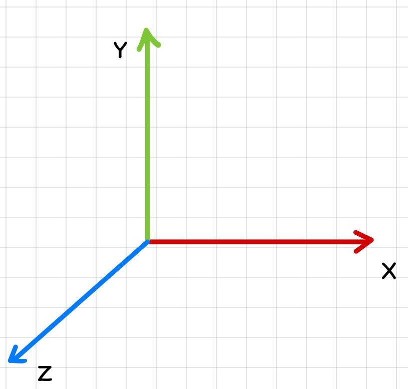
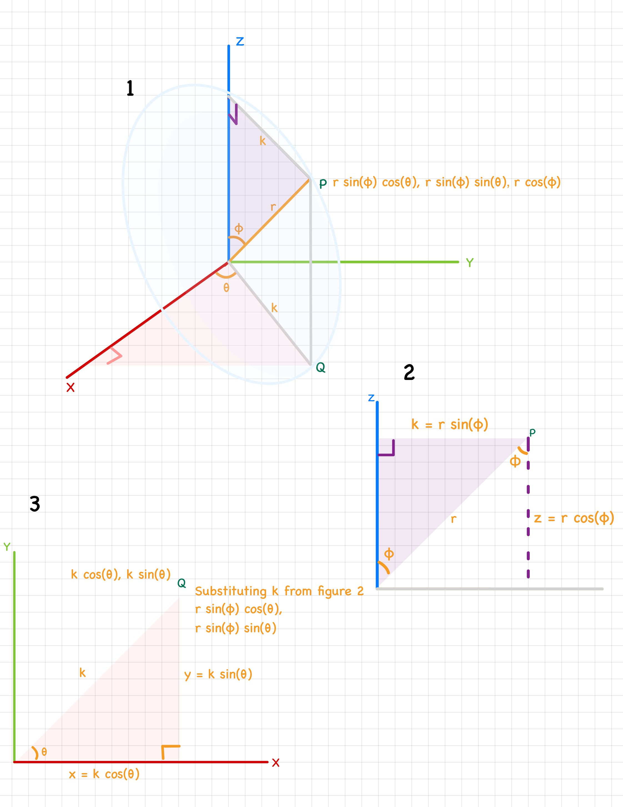

# 3dmath

A header-only 3D math library. 

## Conventions
This library uses the standard right-handed coordinate system 

## Derivations

This section lists proof for formulas used for different features implemented by this library 

### Conversion of spherical coordinates to cartesian coordinates

### Orthographic Projection Matrix

Here is a derivation for the orthographic projection matrix built by <insert link to class here>

