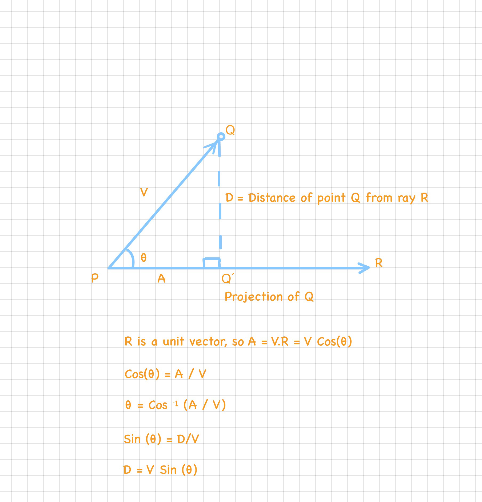

# 3dmath

A header-only 3D math library. 

## Conventions
This library uses the standard right-handed coordinate system 

## Derivations

This section lists proof for formulas used for different features implemented by this library 

### Conversion of spherical coordinates to cartesian coordinates
Used in https://tinyurl.com/sphere-geometry 

### Distance between a point and a ray
Used in https://tinyurl.com/distanceToRay

### Ray-ray intersection
Used in https://tinyurl.com/rayRayIntersection

### Ray-plane intersection
Used in https://tinyurl.com/PlaneRayIntersection

### Ray-sphere intersection
Used in https://tinyurl.com/SphereRayIntersection

### Orthographic Projection Matrix

Here is a derivation for the orthographic projection matrix built by <insert link to class here>

