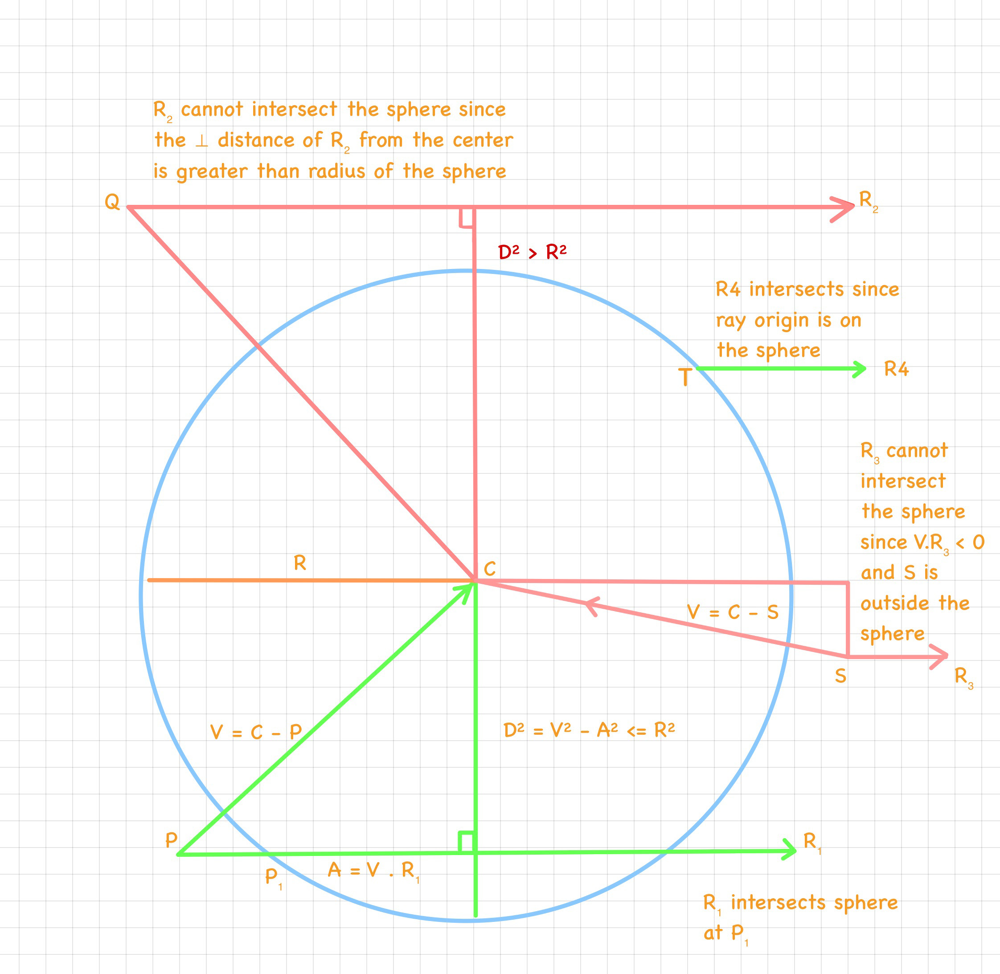
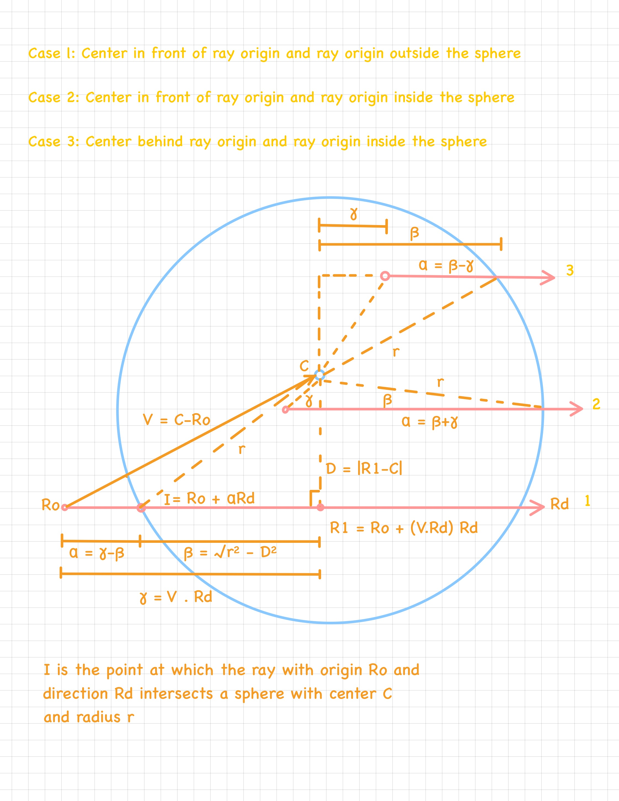

# 3dmath

A header-only 3D math library. 

## Conventions
This library uses the standard right-handed coordinate system 

## Derivations

This section lists proof for formulas used for different features implemented by this library 

### Conversion of spherical coordinates to cartesian coordinates
[Sphere::generateGeometry](https://tinyurl.com/sphere-geometry)  

### Distance between a point and a ray
[Ray::distanceToPoint](https://tinyurl.com/distanceToRay)  

### Ray-ray intersection
[Ray::intersectWithRay](https://tinyurl.com/rayRayIntersection)  

### Ray-plane intersection
[Plane::intersectWithRay](https://tinyurl.com/PlaneRayIntersection)  

### Ray-sphere intersection
[Sphere::intersectWithRay](https://tinyurl.com/SphereRayIntersection)  

### Orthographic Projection Matrix

Here is a derivation for the orthographic projection matrix built by <insert link to class here>

