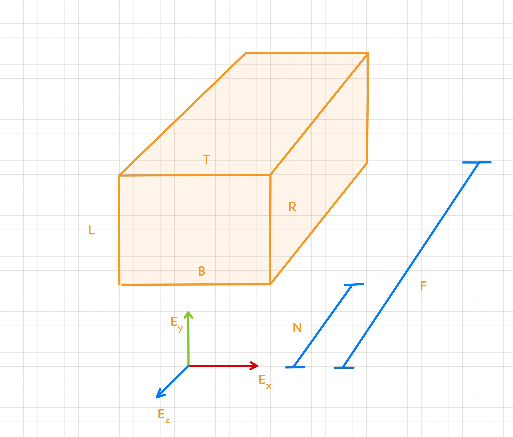
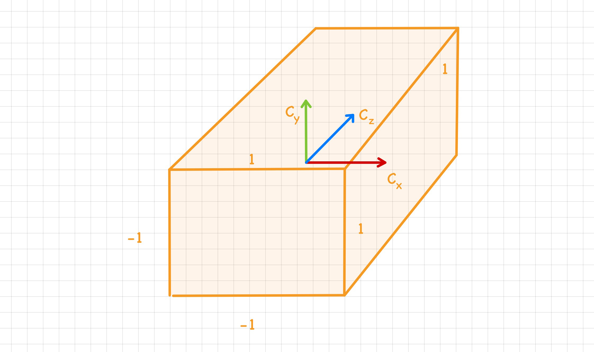

<html lang="en">
<head>
<meta http-equiv="content-type" content="text/html; charset=UTF-8">
<title>Orthographic Projection Matrix</title>
<!--Generated on Mon Aug  7 23:30:06 2023 by LaTeXML (version 0.8.7) http://dlmf.nist.gov/LaTeXML/.-->

<link rel="stylesheet" href="../web/LaTeXML.css" type="text/css">
<link rel="stylesheet" href="../web/ltx-article.css" type="text/css">
<meta name="viewport" content="width=device-width, initial-scale=1, shrink-to-fit=no">
</head>
<body>

<article class="ltx_document">
<section id="Sx1" class="ltx_section ltx_centering">
<h2 class="ltx_title ltx_title_section">Orthographic Projection Matrix</h2>

</section>

In this document, we will derive the orthographic projection matrix created by this library.
This matrix is for a right handed coordinate system and it follows OpenGL conventions for eye and clip space. 

<section id="Sx1.SSx1" class="ltx_subsection">
<h3 class="ltx_title ltx_title_subsection">OpenGL coordinate spaces</h3>

<section id="Sx1.SSx1.SSSx1" class="ltx_subsubsection">
<h4 class="ltx_title ltx_title_subsubsection">Eye coordinate space</h4>

In the eye coordinate space, the eye or the camera is at the origin <math id="Sx1.SSx1.SSSx1.p2.m1" class="ltx_Math" alttext="[0,0,0]" display="inline"><mrow><mo stretchy="false">[</mo><mn>0</mn><mo>,</mo><mn>0</mn><mo>,</mo><mn>0</mn><mo stretchy="false">]</mo></mrow></math> and it looks down the negative z-axis

</section>
<section id="Sx1.SSx1.SSSx2" class="ltx_subsubsection">
<h4 class="ltx_title ltx_title_subsubsection">Clip coordinate space</h4>

<section id="Sx1.SSx1.SSSx2.Px1" class="ltx_paragraph">
<h5 class="ltx_title ltx_title_paragraph"></h5>

In the clip coordinate space, the clipping volume is a cube of length 2. Coordinates of all points inside the clipping volume are in the range <math id="Sx1.SSx1.SSSx2.Px1.p1.m1" class="ltx_Math" alttext="[-1,1]" display="inline"><mrow><mo stretchy="false">[</mo><mrow><mo>−</mo><mn>1</mn></mrow><mo>,</mo><mn>1</mn><mo stretchy="false">]</mo></mrow></math>.

The key difference between the eye and clip space is the orientation of z-axis. In clip space, the positive z-axis is into the screen, in the eye space it is out of the screen.
11
                1

              I suspect the reason for <math id="footnote1.m1" class="ltx_Math" alttext="+z" display="inline"><mrow><mo>+</mo><mi>z</mi></mrow></math> in clip space pointing into the screen is for ease of depth buffer comparison–if an incoming fragment’s <math id="footnote1.m2" class="ltx_Math" alttext="z" display="inline"><mi>z</mi></math> value is less than the previous depth value, it is accepted as it is nearer. If it was the other way around, larger z values would be considered closer to the camera and it sounds unnatural.

</section>
</section>
</section>
<section id="Sx1.SSx2" class="ltx_subsection">
<h3 class="ltx_title ltx_title_subsection">Derivation for the orthographic matrix</h3>

The purpose of the orthographic matrix is to transform coordinates from the eye space to the clip space.

In the eye space, a point’s x-coordinate’s relationship to the clipping planes is

<table id="Sx1.EGx1" class="ltx_equationgroup ltx_eqn_align ltx_eqn_table">

<tbody id="Sx1.E1"><tr class="ltx_equation ltx_eqn_row ltx_align_baseline">
<td class="ltx_eqn_cell ltx_eqn_center_padleft"></td>
<td class="ltx_td ltx_align_right ltx_eqn_cell"><math id="Sx1.E1.m1" class="ltx_Math" alttext="\displaystyle L&lt;=x&lt;=R" display="inline"><mrow><mi>L</mi><mo mathvariant="italic">&lt;=</mo><mi>x</mi><mo mathvariant="italic">&lt;=</mo><mi>R</mi></mrow></math></td>
<td class="ltx_eqn_cell ltx_eqn_center_padright"></td>
<td rowspan="1" class="ltx_eqn_cell ltx_eqn_eqno ltx_align_middle ltx_align_right">(1)</td>
</tr></tbody>
</table>

In the clip space, the same relationship is

<table id="Sx1.EGx2" class="ltx_equationgroup ltx_eqn_align ltx_eqn_table">

<tbody id="Sx1.E2"><tr class="ltx_equation ltx_eqn_row ltx_align_baseline">
<td class="ltx_eqn_cell ltx_eqn_center_padleft"></td>
<td class="ltx_td ltx_align_right ltx_eqn_cell"><math id="Sx1.E2.m1" class="ltx_Math" alttext="\displaystyle-1&lt;=x&lt;=1" display="inline"><mrow><mrow><mo>−</mo><mn>1</mn></mrow><mo mathvariant="italic">&lt;=</mo><mi>x</mi><mo mathvariant="italic">&lt;=</mo><mn>1</mn></mrow></math></td>
<td class="ltx_eqn_cell ltx_eqn_center_padright"></td>
<td rowspan="1" class="ltx_eqn_cell ltx_eqn_eqno ltx_align_middle ltx_align_right">(2)</td>
</tr></tbody>
</table>

The goal of the orthographic matrix is to convert to the second form and it happens by the following set of operations

<table id="Sx1.EGx3" class="ltx_equationgroup ltx_eqn_align ltx_eqn_table">

<tbody><tr class="ltx_eqn_row ltx_align_baseline"><td class="ltx_eqn_cell ltx_align_left" style="white-space:normal;" colspan="4">Subtract L from all sides of the inequality <a href="#Sx1.E1" title="1 ‣ Derivation for the orthographic matrix" class="ltx_ref">1</a>
</td></tr></tbody>
<tbody id="Sx1.E4"><tr class="ltx_equation ltx_eqn_row ltx_align_baseline">
<td class="ltx_eqn_cell ltx_eqn_center_padleft"></td>
<td class="ltx_td ltx_align_right ltx_eqn_cell"><math id="Sx1.E4.m1" class="ltx_Math" alttext="\displaystyle 0&lt;=x-L&lt;=R-L" display="inline"><mrow><mn>0</mn><mo mathvariant="italic">&lt;=</mo><mrow><mi>x</mi><mo>−</mo><mi>L</mi></mrow><mo mathvariant="italic">&lt;=</mo><mrow><mi>R</mi><mo>−</mo><mi>L</mi></mrow></mrow></math></td>
<td class="ltx_eqn_cell ltx_eqn_center_padright"></td>
<td rowspan="1" class="ltx_eqn_cell ltx_eqn_eqno ltx_align_middle ltx_align_right">(4)</td>
</tr></tbody>
<tbody><tr class="ltx_eqn_row ltx_align_baseline"><td class="ltx_eqn_cell ltx_align_left" style="white-space:normal;" colspan="4">Divide by R-L</td></tr></tbody>
<tbody id="Sx1.E5"><tr class="ltx_equation ltx_eqn_row ltx_align_baseline">
<td class="ltx_eqn_cell ltx_eqn_center_padleft"></td>
<td class="ltx_td ltx_align_right ltx_eqn_cell"><math id="Sx1.E5.m1" class="ltx_Math" alttext="\displaystyle 0&lt;=\dfrac{x-L}{R-L}&lt;=1" display="inline"><mrow><mn>0</mn><mo mathvariant="italic">&lt;=</mo><mstyle displaystyle="true"><mfrac><mrow><mi>x</mi><mo>−</mo><mi>L</mi></mrow><mrow><mi>R</mi><mo>−</mo><mi>L</mi></mrow></mfrac></mstyle><mo mathvariant="italic">&lt;=</mo><mn>1</mn></mrow></math></td>
<td class="ltx_eqn_cell ltx_eqn_center_padright"></td>
<td rowspan="1" class="ltx_eqn_cell ltx_eqn_eqno ltx_align_middle ltx_align_right">(5)</td>
</tr></tbody>
<tbody><tr class="ltx_eqn_row ltx_align_baseline"><td class="ltx_eqn_cell ltx_align_left" style="white-space:normal;" colspan="4">Multiply by 2</td></tr></tbody>
<tbody id="Sx1.E6"><tr class="ltx_equation ltx_eqn_row ltx_align_baseline">
<td class="ltx_eqn_cell ltx_eqn_center_padleft"></td>
<td class="ltx_td ltx_align_right ltx_eqn_cell"><math id="Sx1.E6.m1" class="ltx_Math" alttext="\displaystyle 0&lt;=\dfrac{2(x-L)}{R-L}&lt;=2" display="inline"><mrow><mn>0</mn><mo mathvariant="italic">&lt;=</mo><mstyle displaystyle="true"><mfrac><mrow><mn>2</mn><mo>⁢</mo><mrow><mo stretchy="false">(</mo><mrow><mi>x</mi><mo>−</mo><mi>L</mi></mrow><mo stretchy="false">)</mo></mrow></mrow><mrow><mi>R</mi><mo>−</mo><mi>L</mi></mrow></mfrac></mstyle><mo mathvariant="italic">&lt;=</mo><mn>2</mn></mrow></math></td>
<td class="ltx_eqn_cell ltx_eqn_center_padright"></td>
<td rowspan="1" class="ltx_eqn_cell ltx_eqn_eqno ltx_align_middle ltx_align_right">(6)</td>
</tr></tbody>
<tbody><tr class="ltx_eqn_row ltx_align_baseline"><td class="ltx_eqn_cell ltx_align_left" style="white-space:normal;" colspan="4">Subtract 1</td></tr></tbody>
<tbody id="Sx1.E7"><tr class="ltx_equation ltx_eqn_row ltx_align_baseline">
<td class="ltx_eqn_cell ltx_eqn_center_padleft"></td>
<td class="ltx_td ltx_align_right ltx_eqn_cell"><math id="Sx1.E7.m1" class="ltx_Math" alttext="\displaystyle-1&lt;=\dfrac{2(x-L)}{R-L}-1&lt;=1" display="inline"><mrow><mrow><mo>−</mo><mn>1</mn></mrow><mo mathvariant="italic">&lt;=</mo><mrow><mstyle displaystyle="true"><mfrac><mrow><mn>2</mn><mo>⁢</mo><mrow><mo stretchy="false">(</mo><mrow><mi>x</mi><mo>−</mo><mi>L</mi></mrow><mo stretchy="false">)</mo></mrow></mrow><mrow><mi>R</mi><mo>−</mo><mi>L</mi></mrow></mfrac></mstyle><mo>−</mo><mn>1</mn></mrow><mo mathvariant="italic">&lt;=</mo><mn>1</mn></mrow></math></td>
<td class="ltx_eqn_cell ltx_eqn_center_padright"></td>
<td rowspan="1" class="ltx_eqn_cell ltx_eqn_eqno ltx_align_middle ltx_align_right">(7)</td>
</tr></tbody>
<tbody><tr class="ltx_eqn_row ltx_align_baseline"><td class="ltx_eqn_cell ltx_align_left" style="white-space:normal;" colspan="4">Simplifying</td></tr></tbody>
<tbody id="Sx1.E8"><tr class="ltx_equation ltx_eqn_row ltx_align_baseline">
<td class="ltx_eqn_cell ltx_eqn_center_padleft"></td>
<td class="ltx_td ltx_align_right ltx_eqn_cell"><math id="Sx1.E8.m1" class="ltx_Math" alttext="\displaystyle-1&lt;=\dfrac{(2x-2L-R+L)}{R-L}&lt;=1" display="inline"><mrow><mrow><mo>−</mo><mn>1</mn></mrow><mo mathvariant="italic">&lt;=</mo><mstyle displaystyle="true"><mfrac><mrow><mo stretchy="false">(</mo><mrow><mrow><mrow><mn>2</mn><mo>⁢</mo><mi>x</mi></mrow><mo>−</mo><mrow><mn>2</mn><mo>⁢</mo><mi>L</mi></mrow><mo>−</mo><mi>R</mi></mrow><mo>+</mo><mi>L</mi></mrow><mo stretchy="false">)</mo></mrow><mrow><mi>R</mi><mo>−</mo><mi>L</mi></mrow></mfrac></mstyle><mo mathvariant="italic">&lt;=</mo><mn>1</mn></mrow></math></td>
<td class="ltx_eqn_cell ltx_eqn_center_padright"></td>
<td rowspan="1" class="ltx_eqn_cell ltx_eqn_eqno ltx_align_middle ltx_align_right">(8)</td>
</tr></tbody>
<tbody id="Sx1.E9"><tr class="ltx_equation ltx_eqn_row ltx_align_baseline">
<td class="ltx_eqn_cell ltx_eqn_center_padleft"></td>
<td class="ltx_td ltx_align_right ltx_eqn_cell"><math id="Sx1.E9.m1" class="ltx_Math" alttext="\displaystyle-1&lt;=\dfrac{(2x-L-R)}{R-L}&lt;=1" display="inline"><mrow><mrow><mo>−</mo><mn>1</mn></mrow><mo mathvariant="italic">&lt;=</mo><mstyle displaystyle="true"><mfrac><mrow><mo stretchy="false">(</mo><mrow><mrow><mn>2</mn><mo>⁢</mo><mi>x</mi></mrow><mo>−</mo><mi>L</mi><mo>−</mo><mi>R</mi></mrow><mo stretchy="false">)</mo></mrow><mrow><mi>R</mi><mo>−</mo><mi>L</mi></mrow></mfrac></mstyle><mo mathvariant="italic">&lt;=</mo><mn>1</mn></mrow></math></td>
<td class="ltx_eqn_cell ltx_eqn_center_padright"></td>
<td rowspan="1" class="ltx_eqn_cell ltx_eqn_eqno ltx_align_middle ltx_align_right">(9)</td>
</tr></tbody>
<tbody id="Sx1.E10"><tr class="ltx_equation ltx_eqn_row ltx_align_baseline">
<td class="ltx_eqn_cell ltx_eqn_center_padleft"></td>
<td class="ltx_td ltx_align_right ltx_eqn_cell"><math id="Sx1.E10.m1" class="ltx_Math" alttext="\displaystyle-1&lt;=\dfrac{2x}{R-L}-\dfrac{R+L}{R-L}&lt;=1" display="inline"><mrow><mrow><mo>−</mo><mn>1</mn></mrow><mo mathvariant="italic">&lt;=</mo><mrow><mstyle displaystyle="true"><mfrac><mrow><mn>2</mn><mo>⁢</mo><mi>x</mi></mrow><mrow><mi>R</mi><mo>−</mo><mi>L</mi></mrow></mfrac></mstyle><mo>−</mo><mstyle displaystyle="true"><mfrac><mrow><mi>R</mi><mo>+</mo><mi>L</mi></mrow><mrow><mi>R</mi><mo>−</mo><mi>L</mi></mrow></mfrac></mstyle></mrow><mo mathvariant="italic">&lt;=</mo><mn>1</mn></mrow></math></td>
<td class="ltx_eqn_cell ltx_eqn_center_padright"></td>
<td rowspan="1" class="ltx_eqn_cell ltx_eqn_eqno ltx_align_middle ltx_align_right">(10)</td>
</tr></tbody>
</table>

Similarly for y, we can derive the relationship

<table id="Sx1.EGx4" class="ltx_equationgroup ltx_eqn_align ltx_eqn_table">

<tbody id="Sx1.E11"><tr class="ltx_equation ltx_eqn_row ltx_align_baseline">
<td class="ltx_eqn_cell ltx_eqn_center_padleft"></td>
<td class="ltx_td ltx_align_right ltx_eqn_cell"><math id="Sx1.E11.m1" class="ltx_Math" alttext="\displaystyle-1&lt;=\dfrac{2y}{T-B}-\dfrac{T+B}{T-B}&lt;=1" display="inline"><mrow><mrow><mo>−</mo><mn>1</mn></mrow><mo mathvariant="italic">&lt;=</mo><mrow><mstyle displaystyle="true"><mfrac><mrow><mn>2</mn><mo>⁢</mo><mi>y</mi></mrow><mrow><mi>T</mi><mo>−</mo><mi>B</mi></mrow></mfrac></mstyle><mo>−</mo><mstyle displaystyle="true"><mfrac><mrow><mi>T</mi><mo>+</mo><mi>B</mi></mrow><mrow><mi>T</mi><mo>−</mo><mi>B</mi></mrow></mfrac></mstyle></mrow><mo mathvariant="italic">&lt;=</mo><mn>1</mn></mrow></math></td>
<td class="ltx_eqn_cell ltx_eqn_center_padright"></td>
<td rowspan="1" class="ltx_eqn_cell ltx_eqn_eqno ltx_align_middle ltx_align_right">(11)</td>
</tr></tbody>
</table>

For z, things get a little different because of the fact that both near and far clipping planes are planes are along the negative z-axis in the eye space. Since both near and far are negative, it must be observed that z-coordinate in eye space obey the relationship

<table id="Sx1.EGx5" class="ltx_equationgroup ltx_eqn_align ltx_eqn_table">

<tbody id="Sx1.E12"><tr class="ltx_equation ltx_eqn_row ltx_align_baseline">
<td class="ltx_eqn_cell ltx_eqn_center_padleft"></td>
<td class="ltx_td ltx_align_right ltx_eqn_cell"><math id="Sx1.E12.m1" class="ltx_Math" alttext="\displaystyle F&lt;=z&lt;=N" display="inline"><mrow><mi>F</mi><mo mathvariant="italic">&lt;=</mo><mi>z</mi><mo mathvariant="italic">&lt;=</mo><mi>N</mi></mrow></math></td>
<td class="ltx_eqn_cell ltx_eqn_center_padright"></td>
<td rowspan="1" class="ltx_eqn_cell ltx_eqn_eqno ltx_align_middle ltx_align_right">(12)</td>
</tr></tbody>
</table>

Applying the same principle as above, we can continue the derivation

<table id="Sx1.EGx6" class="ltx_equationgroup ltx_eqn_align ltx_eqn_table">

<tbody><tr class="ltx_eqn_row ltx_align_baseline"><td class="ltx_eqn_cell ltx_align_left" style="white-space:normal;" colspan="4">Subtract F from all sides of the inequality <a href="#Sx1.E1" title="1 ‣ Derivation for the orthographic matrix" class="ltx_ref">1</a>
</td></tr></tbody>
<tbody id="Sx1.E14"><tr class="ltx_equation ltx_eqn_row ltx_align_baseline">
<td class="ltx_eqn_cell ltx_eqn_center_padleft"></td>
<td class="ltx_td ltx_align_right ltx_eqn_cell"><math id="Sx1.E14.m1" class="ltx_Math" alttext="\displaystyle 0&lt;=z-F&lt;=N-F" display="inline"><mrow><mn>0</mn><mo mathvariant="italic">&lt;=</mo><mrow><mi>z</mi><mo>−</mo><mi>F</mi></mrow><mo mathvariant="italic">&lt;=</mo><mrow><mi>N</mi><mo>−</mo><mi>F</mi></mrow></mrow></math></td>
<td class="ltx_eqn_cell ltx_eqn_center_padright"></td>
<td rowspan="1" class="ltx_eqn_cell ltx_eqn_eqno ltx_align_middle ltx_align_right">(14)</td>
</tr></tbody>
<tbody><tr class="ltx_eqn_row ltx_align_baseline"><td class="ltx_eqn_cell ltx_align_left" style="white-space:normal;" colspan="4">Divide by N-F</td></tr></tbody>
<tbody id="Sx1.E15"><tr class="ltx_equation ltx_eqn_row ltx_align_baseline">
<td class="ltx_eqn_cell ltx_eqn_center_padleft"></td>
<td class="ltx_td ltx_align_right ltx_eqn_cell"><math id="Sx1.E15.m1" class="ltx_Math" alttext="\displaystyle 0&lt;=\dfrac{z-F}{N-F}&lt;=1" display="inline"><mrow><mn>0</mn><mo mathvariant="italic">&lt;=</mo><mstyle displaystyle="true"><mfrac><mrow><mi>z</mi><mo>−</mo><mi>F</mi></mrow><mrow><mi>N</mi><mo>−</mo><mi>F</mi></mrow></mfrac></mstyle><mo mathvariant="italic">&lt;=</mo><mn>1</mn></mrow></math></td>
<td class="ltx_eqn_cell ltx_eqn_center_padright"></td>
<td rowspan="1" class="ltx_eqn_cell ltx_eqn_eqno ltx_align_middle ltx_align_right">(15)</td>
</tr></tbody>
<tbody><tr class="ltx_eqn_row ltx_align_baseline"><td class="ltx_eqn_cell ltx_align_left" style="white-space:normal;" colspan="4">Multiply by 2</td></tr></tbody>
<tbody id="Sx1.E16"><tr class="ltx_equation ltx_eqn_row ltx_align_baseline">
<td class="ltx_eqn_cell ltx_eqn_center_padleft"></td>
<td class="ltx_td ltx_align_right ltx_eqn_cell"><math id="Sx1.E16.m1" class="ltx_Math" alttext="\displaystyle 0&lt;=\dfrac{2(z-F)}{N-F}&lt;=2" display="inline"><mrow><mn>0</mn><mo mathvariant="italic">&lt;=</mo><mstyle displaystyle="true"><mfrac><mrow><mn>2</mn><mo>⁢</mo><mrow><mo stretchy="false">(</mo><mrow><mi>z</mi><mo>−</mo><mi>F</mi></mrow><mo stretchy="false">)</mo></mrow></mrow><mrow><mi>N</mi><mo>−</mo><mi>F</mi></mrow></mfrac></mstyle><mo mathvariant="italic">&lt;=</mo><mn>2</mn></mrow></math></td>
<td class="ltx_eqn_cell ltx_eqn_center_padright"></td>
<td rowspan="1" class="ltx_eqn_cell ltx_eqn_eqno ltx_align_middle ltx_align_right">(16)</td>
</tr></tbody>
<tbody><tr class="ltx_eqn_row ltx_align_baseline"><td class="ltx_eqn_cell ltx_align_left" style="white-space:normal;" colspan="4">Subtract 1</td></tr></tbody>
<tbody id="Sx1.E17"><tr class="ltx_equation ltx_eqn_row ltx_align_baseline">
<td class="ltx_eqn_cell ltx_eqn_center_padleft"></td>
<td class="ltx_td ltx_align_right ltx_eqn_cell"><math id="Sx1.E17.m1" class="ltx_Math" alttext="\displaystyle-1&lt;=\dfrac{2(z-F)}{N-F}-1&lt;=1" display="inline"><mrow><mrow><mo>−</mo><mn>1</mn></mrow><mo mathvariant="italic">&lt;=</mo><mrow><mstyle displaystyle="true"><mfrac><mrow><mn>2</mn><mo>⁢</mo><mrow><mo stretchy="false">(</mo><mrow><mi>z</mi><mo>−</mo><mi>F</mi></mrow><mo stretchy="false">)</mo></mrow></mrow><mrow><mi>N</mi><mo>−</mo><mi>F</mi></mrow></mfrac></mstyle><mo>−</mo><mn>1</mn></mrow><mo mathvariant="italic">&lt;=</mo><mn>1</mn></mrow></math></td>
<td class="ltx_eqn_cell ltx_eqn_center_padright"></td>
<td rowspan="1" class="ltx_eqn_cell ltx_eqn_eqno ltx_align_middle ltx_align_right">(17)</td>
</tr></tbody>
<tbody><tr class="ltx_eqn_row ltx_align_baseline"><td class="ltx_eqn_cell ltx_align_left" style="white-space:normal;" colspan="4">Simplifying</td></tr></tbody>
<tbody id="Sx1.E18"><tr class="ltx_equation ltx_eqn_row ltx_align_baseline">
<td class="ltx_eqn_cell ltx_eqn_center_padleft"></td>
<td class="ltx_td ltx_align_right ltx_eqn_cell"><math id="Sx1.E18.m1" class="ltx_Math" alttext="\displaystyle-1&lt;=\dfrac{(2z-2F-N+F)}{N-F}&lt;=1" display="inline"><mrow><mrow><mo>−</mo><mn>1</mn></mrow><mo mathvariant="italic">&lt;=</mo><mstyle displaystyle="true"><mfrac><mrow><mo stretchy="false">(</mo><mrow><mrow><mrow><mn>2</mn><mo>⁢</mo><mi>z</mi></mrow><mo>−</mo><mrow><mn>2</mn><mo>⁢</mo><mi>F</mi></mrow><mo>−</mo><mi>N</mi></mrow><mo>+</mo><mi>F</mi></mrow><mo stretchy="false">)</mo></mrow><mrow><mi>N</mi><mo>−</mo><mi>F</mi></mrow></mfrac></mstyle><mo mathvariant="italic">&lt;=</mo><mn>1</mn></mrow></math></td>
<td class="ltx_eqn_cell ltx_eqn_center_padright"></td>
<td rowspan="1" class="ltx_eqn_cell ltx_eqn_eqno ltx_align_middle ltx_align_right">(18)</td>
</tr></tbody>
<tbody id="Sx1.E19"><tr class="ltx_equation ltx_eqn_row ltx_align_baseline">
<td class="ltx_eqn_cell ltx_eqn_center_padleft"></td>
<td class="ltx_td ltx_align_right ltx_eqn_cell"><math id="Sx1.E19.m1" class="ltx_Math" alttext="\displaystyle-1&lt;=\dfrac{(2z-N-F)}{N-F}&lt;=1" display="inline"><mrow><mrow><mo>−</mo><mn>1</mn></mrow><mo mathvariant="italic">&lt;=</mo><mstyle displaystyle="true"><mfrac><mrow><mo stretchy="false">(</mo><mrow><mrow><mn>2</mn><mo>⁢</mo><mi>z</mi></mrow><mo>−</mo><mi>N</mi><mo>−</mo><mi>F</mi></mrow><mo stretchy="false">)</mo></mrow><mrow><mi>N</mi><mo>−</mo><mi>F</mi></mrow></mfrac></mstyle><mo mathvariant="italic">&lt;=</mo><mn>1</mn></mrow></math></td>
<td class="ltx_eqn_cell ltx_eqn_center_padright"></td>
<td rowspan="1" class="ltx_eqn_cell ltx_eqn_eqno ltx_align_middle ltx_align_right">(19)</td>
</tr></tbody>
<tbody id="Sx1.E20"><tr class="ltx_equation ltx_eqn_row ltx_align_baseline">
<td class="ltx_eqn_cell ltx_eqn_center_padleft"></td>
<td class="ltx_td ltx_align_right ltx_eqn_cell"><math id="Sx1.E20.m1" class="ltx_Math" alttext="\displaystyle-1&lt;=\dfrac{2z}{N-F}-\dfrac{F+N}{N-F}&lt;=1" display="inline"><mrow><mrow><mo>−</mo><mn>1</mn></mrow><mo mathvariant="italic">&lt;=</mo><mrow><mstyle displaystyle="true"><mfrac><mrow><mn>2</mn><mo>⁢</mo><mi>z</mi></mrow><mrow><mi>N</mi><mo>−</mo><mi>F</mi></mrow></mfrac></mstyle><mo>−</mo><mstyle displaystyle="true"><mfrac><mrow><mi>F</mi><mo>+</mo><mi>N</mi></mrow><mrow><mi>N</mi><mo>−</mo><mi>F</mi></mrow></mfrac></mstyle></mrow><mo mathvariant="italic">&lt;=</mo><mn>1</mn></mrow></math></td>
<td class="ltx_eqn_cell ltx_eqn_center_padright"></td>
<td rowspan="1" class="ltx_eqn_cell ltx_eqn_eqno ltx_align_middle ltx_align_right">(20)</td>
</tr></tbody>
</table>

Arranging these expressions in a matrix form such that <math id="Sx1.SSx2.p14.m1" class="ltx_Math" alttext="[x,y,z]" display="inline"><mrow><mo stretchy="false">[</mo><mi>x</mi><mo>,</mo><mi>y</mi><mo>,</mo><mi>z</mi><mo stretchy="false">]</mo></mrow></math> will transform to these expressions produces matrix

<table id="Sx1.EGx7" class="ltx_equationgroup ltx_eqn_align ltx_eqn_table">

<tbody id="Sx1.E28"><tr class="ltx_equation ltx_eqn_row ltx_align_baseline">
<td class="ltx_eqn_cell ltx_eqn_center_padleft"></td>
<td class="ltx_td ltx_align_right ltx_eqn_cell"><math id="Sx1.E28.m1" class="ltx_Math" alttext="\displaystyle\begin{bmatrix}\dfrac{2}{R-L}&amp;0&amp;0&amp;-\dfrac{R+L}{R-L}\\
\\
0&amp;\dfrac{2}{B-T}&amp;0&amp;-\dfrac{T+B}{T-B}\\
\\
0&amp;0&amp;\dfrac{2}{N-F}&amp;-\dfrac{F+N}{N-F}\\
\\
0&amp;0&amp;0&amp;1\end{bmatrix}" display="inline"><mrow><mo>[</mo><mtable columnspacing="5pt" rowspacing="0pt"><mtr><mtd><mstyle displaystyle="true"><mfrac><mn>2</mn><mrow><mi>R</mi><mo>−</mo><mi>L</mi></mrow></mfrac></mstyle></mtd><mtd><mn>0</mn></mtd><mtd><mn>0</mn></mtd><mtd><mrow><mo>−</mo><mstyle displaystyle="true"><mfrac><mrow><mi>R</mi><mo>+</mo><mi>L</mi></mrow><mrow><mi>R</mi><mo>−</mo><mi>L</mi></mrow></mfrac></mstyle></mrow></mtd></mtr><mtr><mtd></mtd></mtr><mtr><mtd><mn>0</mn></mtd><mtd><mstyle displaystyle="true"><mfrac><mn>2</mn><mrow><mi>B</mi><mo>−</mo><mi>T</mi></mrow></mfrac></mstyle></mtd><mtd><mn>0</mn></mtd><mtd><mrow><mo>−</mo><mstyle displaystyle="true"><mfrac><mrow><mi>T</mi><mo>+</mo><mi>B</mi></mrow><mrow><mi>T</mi><mo>−</mo><mi>B</mi></mrow></mfrac></mstyle></mrow></mtd></mtr><mtr><mtd></mtd></mtr><mtr><mtd><mn>0</mn></mtd><mtd><mn>0</mn></mtd><mtd><mstyle displaystyle="true"><mfrac><mn>2</mn><mrow><mi>N</mi><mo>−</mo><mi>F</mi></mrow></mfrac></mstyle></mtd><mtd><mrow><mo>−</mo><mstyle displaystyle="true"><mfrac><mrow><mi>F</mi><mo>+</mo><mi>N</mi></mrow><mrow><mi>N</mi><mo>−</mo><mi>F</mi></mrow></mfrac></mstyle></mrow></mtd></mtr><mtr><mtd></mtd></mtr><mtr><mtd><mn>0</mn></mtd><mtd><mn>0</mn></mtd><mtd><mn>0</mn></mtd><mtd><mn>1</mn></mtd></mtr></mtable><mo>]</mo></mrow></math></td>
<td class="ltx_eqn_cell ltx_eqn_center_padright"></td>
<td rowspan="1" class="ltx_eqn_cell ltx_eqn_eqno ltx_align_middle ltx_align_right">(28)</td>
</tr></tbody>
</table>

Applying this matrix to <math id="Sx1.SSx2.p16.m1" class="ltx_Math" alttext="[x_{eye},y_{eye},z_{eye},1]" display="inline"><mrow><mo stretchy="false">[</mo><msub><mi>x</mi><mrow><mi>e</mi><mo>⁢</mo><mi>y</mi><mo>⁢</mo><mi>e</mi></mrow></msub><mo>,</mo><msub><mi>y</mi><mrow><mi>e</mi><mo>⁢</mo><mi>y</mi><mo>⁢</mo><mi>e</mi></mrow></msub><mo>,</mo><msub><mi>z</mi><mrow><mi>e</mi><mo>⁢</mo><mi>y</mi><mo>⁢</mo><mi>e</mi></mrow></msub><mo>,</mo><mn>1</mn><mo stretchy="false">]</mo></mrow></math>

<table id="Sx1.EGx8" class="ltx_equationgroup ltx_eqn_align ltx_eqn_table">

<tbody id="Sx1.E43"><tr class="ltx_equation ltx_eqn_row ltx_align_baseline">
<td class="ltx_eqn_cell ltx_eqn_center_padleft"></td>
<td class="ltx_td ltx_align_right ltx_eqn_cell"><math id="Sx1.E43.m1" class="ltx_Math" alttext="\displaystyle\begin{bmatrix}\dfrac{2}{R-L}&amp;0&amp;0&amp;-\dfrac{R+L}{R-L}\\
\\
0&amp;\dfrac{2}{B-T}&amp;0&amp;-\dfrac{T+B}{T-B}\\
\\
0&amp;0&amp;\dfrac{2}{N-F}&amp;-\dfrac{F+N}{N-F}\\
\\
0&amp;0&amp;0&amp;1\end{bmatrix}\times\begin{bmatrix}x_{eye}\\
\\
y_{eye}\\
\\
z_{eye}\\
\\
1\end{bmatrix}" display="inline"><mrow><mrow><mo>[</mo><mtable columnspacing="5pt" rowspacing="0pt"><mtr><mtd><mstyle displaystyle="true"><mfrac><mn>2</mn><mrow><mi>R</mi><mo>−</mo><mi>L</mi></mrow></mfrac></mstyle></mtd><mtd><mn>0</mn></mtd><mtd><mn>0</mn></mtd><mtd><mrow><mo>−</mo><mstyle displaystyle="true"><mfrac><mrow><mi>R</mi><mo>+</mo><mi>L</mi></mrow><mrow><mi>R</mi><mo>−</mo><mi>L</mi></mrow></mfrac></mstyle></mrow></mtd></mtr><mtr><mtd></mtd></mtr><mtr><mtd><mn>0</mn></mtd><mtd><mstyle displaystyle="true"><mfrac><mn>2</mn><mrow><mi>B</mi><mo>−</mo><mi>T</mi></mrow></mfrac></mstyle></mtd><mtd><mn>0</mn></mtd><mtd><mrow><mo>−</mo><mstyle displaystyle="true"><mfrac><mrow><mi>T</mi><mo>+</mo><mi>B</mi></mrow><mrow><mi>T</mi><mo>−</mo><mi>B</mi></mrow></mfrac></mstyle></mrow></mtd></mtr><mtr><mtd></mtd></mtr><mtr><mtd><mn>0</mn></mtd><mtd><mn>0</mn></mtd><mtd><mstyle displaystyle="true"><mfrac><mn>2</mn><mrow><mi>N</mi><mo>−</mo><mi>F</mi></mrow></mfrac></mstyle></mtd><mtd><mrow><mo>−</mo><mstyle displaystyle="true"><mfrac><mrow><mi>F</mi><mo>+</mo><mi>N</mi></mrow><mrow><mi>N</mi><mo>−</mo><mi>F</mi></mrow></mfrac></mstyle></mrow></mtd></mtr><mtr><mtd></mtd></mtr><mtr><mtd><mn>0</mn></mtd><mtd><mn>0</mn></mtd><mtd><mn>0</mn></mtd><mtd><mn>1</mn></mtd></mtr></mtable><mo rspace="0.055em">]</mo></mrow><mo rspace="0.222em">×</mo><mrow><mo>[</mo><mtable rowspacing="0pt"><mtr><mtd><msub><mi>x</mi><mrow><mi>e</mi><mo>⁢</mo><mi>y</mi><mo>⁢</mo><mi>e</mi></mrow></msub></mtd></mtr><mtr><mtd></mtd></mtr><mtr><mtd><msub><mi>y</mi><mrow><mi>e</mi><mo>⁢</mo><mi>y</mi><mo>⁢</mo><mi>e</mi></mrow></msub></mtd></mtr><mtr><mtd></mtd></mtr><mtr><mtd><msub><mi>z</mi><mrow><mi>e</mi><mo>⁢</mo><mi>y</mi><mo>⁢</mo><mi>e</mi></mrow></msub></mtd></mtr><mtr><mtd></mtd></mtr><mtr><mtd><mn>1</mn></mtd></mtr></mtable><mo>]</mo></mrow></mrow></math></td>
<td class="ltx_eqn_cell ltx_eqn_center_padright"></td>
<td rowspan="1" class="ltx_eqn_cell ltx_eqn_eqno ltx_align_middle ltx_align_right">(43)</td>
</tr></tbody>
</table>

produces the clip space coordinates 22
            2

          Note that the <math id="footnote2.m1" class="ltx_Math" alttext="w" display="inline"><mi>w</mi></math> coordinate is <math id="footnote2.m2" class="ltx_Math" alttext="1" display="inline"><mn>1</mn></math>. Therefore, when this 4D coordinate is converted to 3D by dividing by <math id="footnote2.m3" class="ltx_Math" alttext="w" display="inline"><mi>w</mi></math>, the z-coordinate remains unchanged. This is why there is no perspective foreshortening in orthographic projection

<table id="Sx1.EGx9" class="ltx_equationgroup ltx_eqn_align ltx_eqn_table">

<tbody id="Sx1.E58"><tr class="ltx_equation ltx_eqn_row ltx_align_baseline">
<td class="ltx_eqn_cell ltx_eqn_center_padleft"></td>
<td class="ltx_td ltx_align_right ltx_eqn_cell"><math id="Sx1.E58.m1" class="ltx_Math" alttext="\displaystyle\begin{bmatrix}x_{clip}\\
\\
y_{clip}\\
\\
z_{clip}\\
\\
1\end{bmatrix}=\begin{bmatrix}\dfrac{2x_{eye}}{R-L}-\dfrac{R+L}{R-L}\\
\\
\dfrac{2y_{eye}}{T-B}-\dfrac{T+B}{T-B}\\
\\
\dfrac{2z_{eye}}{N-F}-\dfrac{F+N}{N-F}\\
\\
1\end{bmatrix}" display="inline"><mrow><mrow><mo>[</mo><mtable rowspacing="0pt"><mtr><mtd><msub><mi>x</mi><mrow><mi>c</mi><mo>⁢</mo><mi>l</mi><mo>⁢</mo><mi>i</mi><mo>⁢</mo><mi>p</mi></mrow></msub></mtd></mtr><mtr><mtd></mtd></mtr><mtr><mtd><msub><mi>y</mi><mrow><mi>c</mi><mo>⁢</mo><mi>l</mi><mo>⁢</mo><mi>i</mi><mo>⁢</mo><mi>p</mi></mrow></msub></mtd></mtr><mtr><mtd></mtd></mtr><mtr><mtd><msub><mi>z</mi><mrow><mi>c</mi><mo>⁢</mo><mi>l</mi><mo>⁢</mo><mi>i</mi><mo>⁢</mo><mi>p</mi></mrow></msub></mtd></mtr><mtr><mtd></mtd></mtr><mtr><mtd><mn>1</mn></mtd></mtr></mtable><mo>]</mo></mrow><mo>=</mo><mrow><mo>[</mo><mtable rowspacing="0pt"><mtr><mtd><mrow><mstyle displaystyle="true"><mfrac><mrow><mn>2</mn><mo>⁢</mo><msub><mi>x</mi><mrow><mi>e</mi><mo>⁢</mo><mi>y</mi><mo>⁢</mo><mi>e</mi></mrow></msub></mrow><mrow><mi>R</mi><mo>−</mo><mi>L</mi></mrow></mfrac></mstyle><mo>−</mo><mstyle displaystyle="true"><mfrac><mrow><mi>R</mi><mo>+</mo><mi>L</mi></mrow><mrow><mi>R</mi><mo>−</mo><mi>L</mi></mrow></mfrac></mstyle></mrow></mtd></mtr><mtr><mtd></mtd></mtr><mtr><mtd><mrow><mstyle displaystyle="true"><mfrac><mrow><mn>2</mn><mo>⁢</mo><msub><mi>y</mi><mrow><mi>e</mi><mo>⁢</mo><mi>y</mi><mo>⁢</mo><mi>e</mi></mrow></msub></mrow><mrow><mi>T</mi><mo>−</mo><mi>B</mi></mrow></mfrac></mstyle><mo>−</mo><mstyle displaystyle="true"><mfrac><mrow><mi>T</mi><mo>+</mo><mi>B</mi></mrow><mrow><mi>T</mi><mo>−</mo><mi>B</mi></mrow></mfrac></mstyle></mrow></mtd></mtr><mtr><mtd></mtd></mtr><mtr><mtd><mrow><mstyle displaystyle="true"><mfrac><mrow><mn>2</mn><mo>⁢</mo><msub><mi>z</mi><mrow><mi>e</mi><mo>⁢</mo><mi>y</mi><mo>⁢</mo><mi>e</mi></mrow></msub></mrow><mrow><mi>N</mi><mo>−</mo><mi>F</mi></mrow></mfrac></mstyle><mo>−</mo><mstyle displaystyle="true"><mfrac><mrow><mi>F</mi><mo>+</mo><mi>N</mi></mrow><mrow><mi>N</mi><mo>−</mo><mi>F</mi></mrow></mfrac></mstyle></mrow></mtd></mtr><mtr><mtd></mtd></mtr><mtr><mtd><mn>1</mn></mtd></mtr></mtable><mo>]</mo></mrow></mrow></math></td>
<td class="ltx_eqn_cell ltx_eqn_center_padright"></td>
<td rowspan="1" class="ltx_eqn_cell ltx_eqn_eqno ltx_align_middle ltx_align_right">(58)</td>
</tr></tbody>
</table>

</section>
</article>

</body>
</html>
